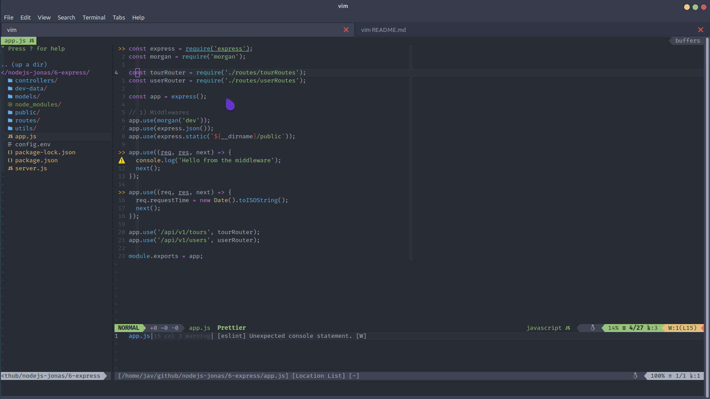

# Vim dotFiles

## Preview

## dotfiles repositório

### Language

| Title                                                                           | Description                                                                                                                                                                                |
| :------------------------------------------------------------------             | :---------------------------------------------------------------------------------------------------------------------------                                                               |
| [ejs-syntax](https://github.com/nikvdp/ejs-syntax)                              | This is a syntax file for editing ejs (embedded javascript) files in vim.                                                                                                                  |
| [styled-components](https://github.com/styled-components/vim-styled-components) | Vim bundle for styled-components, diet-cola, emotion, experimental glamor/styled, and astroturf content in javascript files.                                                               |
| [typescript](https://github.com/soywod/typescript.vim)                          | A sweet mix between pangloss/vim-javascript, mxw/vim-jsx and leafgarland/typescript-vim, in order to have a decent Vim syntax / indent in .ts AND .tsx files. All rights go to these repos.|
| [indentline](https://github.com/yggdroot/indentline)                            | This plugin is used for displaying thin vertical lines at each indentation level for code indented with spaces.                                                                            |
| [vim-jsx-pretty](https://github.com/maxmellon/vim-jsx-pretty)                   | The React syntax highlighting and indenting plugin for vim. Also supports the typescript tsx file.                                                                                         | 
| [vim-prettier](https://github.com/prettier/vim-prettier)                        | A vim plugin wrapper for prettier, pre-configured with custom default prettier settings.                                                                                                   |
| [vim-javascript](https://github.com/pangloss/vim-javascript)                    | JavaScript bundle for vim, this bundle provides syntax highlighting and improved indentation.                                                                                              |
| [vim-css-color](https://github.com/ap/vim-css-color)                            | A very fast, multi-syntax context-sensitive color name highlighter.                                                                                                                        |
| [scss-syntax](https://github.com/cakebaker/scss-syntax.vim)                     | Syntax File for SCSS (Sassy CSS).                                                                                                                                                          |

### Git

| Title                                                                                       | Description                                                            
| :------------------------------------------------------------                               | :--------------------------------------------------------------------- 
| [vim-gitgutter](https://github.com/airblade/vim-gitgutter)                                  | A Vim plugin which shows a git diff in the sign column. It shows which lines have been added, modified, or removed.                     
| [nerdtree-git-plugin](https://github.com/xuyuanp/nerdtree-git-plugin)                       | A plugin of NERDTree showing git status flags.        

### Theme

| Title                                                                            | Description                                                                    
| :-------------------------------------------------------                         | :----------------------------------------------------------------------------- 
| [gruvbox](https://github.com/morhetz/gruvbox)                                    | gruvbox is heavily inspired by badwolf, jellybeans and solarized. 
| [onedark](https://github.com/joshdick/onedark.vim)                               | A dark Vim/Neovim color scheme for the GUI and 16/256/true-color terminals, based on FlatColor, with colors inspired by the excellent One Dark syntax theme for the Atom text editor.                    
| [vim-airline](https://github.com/vim-airline/vim-airline)                        | Lean & mean status/tabline for vim that's light as air.
| [awesome-vim-colorschemes](https://github.com/rafi/awesome-vim-colorschemes)     | Collection of awesome color schemes for Vim, merged for quick use.
| [vim-nerdtree-syntax-highlight](https://github.com/tiagofumo/vim-nerdtree-syntax-highlight) | This adds syntax for nerdtree on most common file extensions.                                   

### Utility

| Title                                                                            | Description                                                                    
| :-------------------------------------------------------                         | :----------------------------------------------------------------------------- 
| [vim-devicons](https://github.com/ryanoasis/vim-devicons)                        | Supports plugins such as NERDTree, vim-airline, CtrlP, powerline, denite, unite, lightline.vim, vim-startify, vimfiler, vim-buffet and flagship. 
| [NERDTree](https://github.com/scrooloose/nerdtree)                               | The NERDTree is a file system explorer for the Vim editor.                    
| [ultisnips](https://github.com/sirver/ultisnips)                                 | UltiSnips is the ultimate solution for snippets in Vim.
| [vim-snippets](https://github.com/honza/vim-snippets)                            | This repository contains snippets files for various programming languages.
| [vim-commentary](https://github.com/tpope/vim-commentary)                        | Comment stuff out.
| [auto-pairs](https://github.com/chun-yang/auto-pairs)                            | Insert or delete brackets, parens, quotes in pair.
| [coc.nvim](https://github.com/neoclide/coc.nvim)                                 | COC.
| [ale](https://github.com/w0rp/ale)                                               | ALE (Asynchronous Lint Engine) is a plugin providing linting (syntax checking and semantic errors) in NeoVim 0.2.0+ and Vim 8 while you edit your text files, and acts as a Vim Language Server Protocol client.
| [emmet-vim](https://github.com/mattn/emmet-vim)                                  | emmet-vim is a vim plug-in which provides support for expanding abbreviations similar to emmet.

